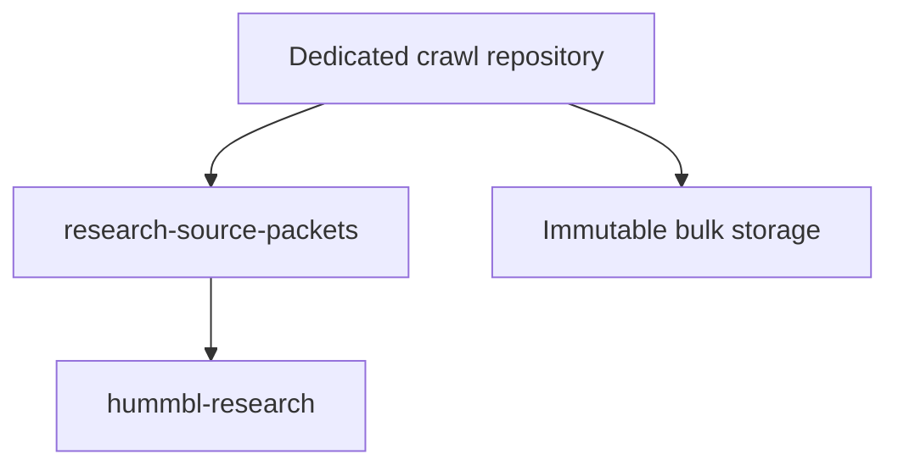

# GitHub Public Knowledge Surface Crawl — Plan v0.2

**Status:** Approved  
**Approved by:** Reuben  
**Approval date:** 2026-07-13  
**Execution status:** Not started  
**Reconnaissance status:** Not started  
**Supersedes:** Plan v0.1

## 1. Objective

Build a governed, resumable, interval-bounded observed corpus of the publicly reachable content exposed through these seeds:

1. `https://github.blog/`
2. `https://github.blog/changelog/`
3. `https://docs.github.com/en`
4. `https://github.com/customer-stories`

The crawl will establish:

- Which URL-addressable routes were discovered.
- Which canonical content units those routes represented.
- Which materially distinct variants were exposed.
- Which observations were successfully retrieved.
- When each observation occurred.
- How each identity and relationship was determined.
- Which resources redirected, duplicated, conflicted, failed, or were inaccessible.
- Whether discovery reached the declared saturation gates.
- What first-party inventory evidence supports the coverage claim.

The result is not an atomic historical snapshot. It is an audited corpus observed over a declared interval.

## 2. Truth boundary

The strongest intended claim is:

> During the declared observation interval, every unique in-scope route, canonical content unit, and materially distinct variant discovered through the approved first-party inventories and rendered-surface discovery methods was accounted for. Every in-scope route was attempted or resolved through documented equivalence evidence, and remaining limitations are explicitly enumerated.

The crawl will not claim:

- A mathematically exhaustive inventory of unknown or undiscoverable URLs.
- An atomic state of all GitHub surfaces at one instant.
- Coverage of content published after the inventory freeze.
- Coverage of authenticated, private, deleted, or policy-prohibited content.
- That a publisher source-repository revision necessarily equals the deployed website revision unless GitHub exposes evidence supporting that correspondence.
- That ChatGPT independently continued working while no active execution environment was running.

## 3. Executor and continuity boundary

### 3.1 Designated durable executor

The designated durable executor is a repository-owned, containerized crawler named provisionally:

`github-public-surface-crawler`

Its planned durable runtime is a manually authorized **Google Cloud Run Job**. This runtime is designated because it can execute independently of a ChatGPT conversation, preserve state outside an interactive session, and resume bounded work from durable checkpoints.

This is an architectural designation, not a claim that the job, bucket, service account, or repository already exists. Their verified provisioning is a start-blocking requirement.

The crawler must be reproducible from:

- A pinned Git commit.
- A pinned container-image digest.
- A versioned scope policy.
- A versioned host policy.
- A versioned schema set.
- A run authorization manifest.

No interactive ChatGPT session is the crawl executor.

### 3.2 ChatGPT's role

ChatGPT may:

- Draft and review plans, schemas, policies, reports, and amendments.
- Review crawler outputs and coverage evidence.
- Help classify exceptions and defects.
- Prepare GitHub issues, branches, files, comments, or PRs when explicitly authorized.
- Recommend starting, pausing, retrying, reopening, or closing a run.
- Inspect checkpoint and receipt evidence made available through authorized tools.

ChatGPT will not be treated as:

- A persistent background process.
- An autonomous multi-day scheduler.
- The durable holder of crawl state.
- Authorized to silently resume work in a later conversation.
- Authorized to start or close a run merely because the plan exists.

### 3.3 Checkpoint location

The designated checkpoint backend is a versioned Google Cloud Storage bucket using this logical layout:

```text
gs://hummbl-github-public-surface-crawl/
  runs/<crawl_id>/
    checkpoints/
    batches/
    leases/
    temporary/
    receipts/
```

Before the first run, the exact verified bucket URI, project, region, retention controls, encryption posture, and service identity must be recorded in a Git-governed executor manifest.

Checkpoint batches will be immutable and content-addressed. Mutable “latest checkpoint” pointers may reference immutable batches but may not replace their historical content.

Periodic checkpoint receipts and hashes will also be committed to the control repository. Git is the governance record; object storage is the durable high-volume execution state.

### 3.4 Resume protocol

A resumed execution must:

1. Receive the existing `crawl_id`; it must not silently create a replacement run.
2. Load the approved run manifest from the control repository.
3. Verify the plan, scope, policy, schema, source commit, and container-image hashes.
4. Acquire a generation-checked execution lease.
5. Locate the newest complete checkpoint whose manifest and object hashes validate.
6. Replay any complete immutable batches written after that checkpoint.
7. Ignore or quarantine incomplete temporary objects.
8. Reconstruct the three inventories and remaining work queue.
9. Preserve completed route observations rather than fetching them again without cause.
10. Continue eligible retries according to their recorded retry state.
11. Emit a resume receipt identifying the prior and new executor instances.
12. Stop if configuration drift, identity conflicts, lease conflicts, or checkpoint corruption is detected.

Infrastructure interruption does not authorize scope expansion or a new run. Resumption must use the same approved run contract.

### 3.5 Authority model

| Action | Default authority |
|---|---|
| Approve plan or material amendment | Reuben |
| Authorize first run | Reuben through a merged run-authorization artifact or equivalent explicit authorization |
| Invoke the authorized executor | Reuben or an explicitly delegated operator |
| Automatically retry a transient request | Executor, within approved retry ceilings |
| Retry a retry-exhausted record | Explicitly authorized operator |
| Safety pause | Executor automatically when a circuit breaker fires |
| Manual pause/cancel | Reuben or explicitly delegated operator |
| Resume a paused/interrupted run | Explicitly authorized operator using the existing `crawl_id` |
| Propose completion | Executor and reviewing agent |
| Declare and merge final closeout | Reuben or repository governance explicitly delegated for that run |
| Reopen a closed run | Reuben through a versioned amendment or corrective run |

Emergency pauses may occur immediately and be backfilled into Git. Starts, scope expansions, and closeouts may not bypass the Git-governed authorization record.

## 4. Observation semantics

The corpus is observed over time, not captured atomically.

Every run will record:

- `crawl_id`
- `plan_version`
- `discovery_started_at`
- `inventory_frozen_at`
- `retrieval_window_started_at`
- `retrieval_window_ended_at`
- `audit_completed_at`
- `closeout_at`
- Crawler commit and image digest.
- Publisher inventory revisions, hashes, ETags, or timestamps where available.

Every retrieval observation will record its own:

- `attempted_at`
- `retrieved_at`
- Response metadata.
- Content fingerprint.
- Applicable publisher-revision evidence.

Discovery retrievals may begin before `inventory_frozen_at`, because rendered pages must often be fetched to discover additional routes. The observation interval therefore may span both discovery and completion retrieval.

### Inventory freezing

`inventory_frozen_at` means:

- The declared discovery channels have completed their initial traversal.
- The route, content-unit, and variant inventories have been materialized.
- The initial inventory manifests have been hashed.
- Subsequent discoveries cannot be silently inserted into the frozen inventory.

A route discovered after the freeze must cause one of:

- A versioned inventory addendum.
- A controlled thaw, reconciliation, and new freeze.
- Deferral to a later delta run.

The closeout report must distinguish the original frozen inventory from any addenda.

### Publisher revision evidence

Where possible, the run will pin:

- The `github/docs` source-repository commit used for inventory reconciliation.
- Sitemap and feed content hashes.
- API response hashes and publisher identifiers.
- Redirect-manifest revisions.
- HTTP `ETag` and `Last-Modified` values.
- Public deployment/build revisions if GitHub exposes them.

A source-repository commit is independent inventory evidence. It is not automatically evidence that the rendered site was deployed from that exact commit.

## 5. Three linked inventories

The word “page” will not be used as the primary counting unit.

### 5.1 Route inventory

A route is a normalized, URL-addressable location that can be requested independently.

Examples:

- A canonical article URL.
- A historical URL that redirects.
- A URL-addressable documentation version.
- A site-exposed filter URL.
- A paginated archive URL.

Redirect aliases remain separate routes even when they resolve to the same content.

### 5.2 Canonical content-unit inventory

A canonical content unit is the publisher-level semantic object represented by one or more routes.

Examples:

- One blog article.
- One changelog entry.
- One documentation topic.
- One customer story.
- One archive or listing state when it is itself a substantive navigable unit.

Two routes may represent one content unit.

### 5.3 Material variant inventory

A variant is a substantively distinct representation of the same content unit along a publisher-declared dimension.

Possible dimensions include:

- GitHub.com versus a supported GHES release.
- Operating system.
- Interface or tool.
- Installation method.
- Product availability.
- Region or deployment context.
- Other publisher-exposed selectors that materially alter the main content.

One content unit may have several variants. A variant may or may not have a separate URL.

### 5.4 Required final accounting

Closeout must report separately:

| Inventory | Required counts |
|---|---|
| Routes | Discovered, in scope, attempted, successfully retrieved, redirected, blocked, failed, excluded, unresolved |
| Content units | Identified, represented by successful observations, represented only by failed routes, conflicted, unresolved |
| Variants | Identified, URL-addressable, sub-page, observed, failed, collapsed as equivalent, unresolved |

The route count must never be presented as the number of unique content units. Variant counts must never be silently folded into either.

## 6. Deterministic identity

### 6.1 Required identifiers

Every governed record must use stable identifiers:

- `route_id`
- `content_unit_id`
- `variant_id`, when applicable
- `observation_id`
- `content_blob_id` or fingerprint
- `crawl_id`

### 6.2 Route identity

A `route_id` will be deterministically derived from a versioned route-normalization algorithm and the normalized URL.

Both must be retained:

- The exact raw discovered URL.
- The normalized URL used for identity and scheduling.

Redirect source and destination routes retain separate route IDs.

### 6.3 Content-unit identity

Priority order:

1. Stable first-party publisher identifier.
2. Stable source-repository identity.
3. Persisted canonical identity registry established from the initial canonical route.
4. A deterministic initial identity derived from a canonical identity key.

Content-unit identity must not be derived solely from current page bytes. Content can change without becoming a new content unit.

Canonical moves must preserve identity through an auditable relationship such as a redirect, publisher ID, source-file continuity, or reviewed identity mapping.

### 6.4 Variant identity

A `variant_id` will be deterministically derived from:

- `content_unit_id`
- A sorted, normalized dimension map.
- The variant-identity schema version.

Example dimension map:

```json
{
  "deployment": "ghes-3.19",
  "platform": "linux",
  "tool": "cli"
}
```

A content fingerprint is separate from identity. It detects observed byte or extracted-content changes but does not define semantic continuity by itself.

## 7. Scope

### Included rendered surfaces

| Seed | Included |
|---|---|
| GitHub Blog | Canonical posts, announcements, engineering articles, company/news content, categories, tags, authors, archives, pagination, and other publisher-exposed content routes on `github.blog` |
| GitHub Changelog | Changelog indexes, publisher-exposed categories and filters, pagination, and individual entries |
| GitHub Docs English | Public English documentation, navigation and index routes, supported version routes, and applicable publisher-exposed variants |
| Customer Stories | Listing routes, publisher-exposed filter states, pagination, individual stories, and canonical related-story routes |

The changelog remains independently reported even though it overlaps the broader blog host.

### Default rendered-crawl exclusions

- GitHub repositories, code, issues, PRs, commits, profiles, organizations, and Discussions, except where an official source repository is used as auxiliary inventory evidence.
- Authenticated or personalized routes.
- Login, account, billing, dashboard, and administrative routes.
- GitHub search permutations.
- Arbitrarily synthesized query combinations.
- Fragment-only variations.
- Static assets such as images, fonts, JavaScript, and CSS.
- Tracking and advertising URLs.
- External domains reached from content pages.
- Non-English Docs.
- Private, deleted, gated, or policy-prohibited content.

Outbound links will be recorded without automatically expanding crawl scope.

## 8. First-party inventory evidence

Publisher-controlled non-rendered sources are explicitly permitted as auxiliary discovery and reconciliation evidence.

These may include:

- Official source repositories.
- Redirect manifests.
- Sitemap indexes.
- Structured feeds.
- Public APIs.
- Generated route inventories.
- Public build manifests.
- Navigation data files.
- Publisher IDs and update timestamps.

Using these sources does not expand the rendered-page crawl scope. A source file or API record is not automatically counted as a rendered route.

### GitHub Docs source repository

The official `github/docs` repository will be a primary independent inventory for Docs.

At `inventory_frozen_at`, the run will pin a specific source commit and use applicable source files, frontmatter, navigation definitions, redirects, version declarations, and generated inventories to reconcile the rendered English documentation surface.

Reconciliation must distinguish:

- Source-defined but not rendered.
- Rendered but absent from the pinned source inventory.
- Redirect-only source routes.
- Versioned source content.
- Generated routes.
- Suspected deployment lag.
- Unexplained discrepancies.

The crawler may not assume source-to-deployment equivalence without evidence.

### Other surfaces

For Blog, Changelog, and Customer Stories, the crawler may use publisher-controlled feeds, APIs, sitemap data, embedded structured data, redirects, and generated inventories discovered during preflight.

Their use remains subject to the same policy and access gate as rendered retrieval.

## 9. Discovery strategy

No single discovery channel establishes coverage.

### Channel A — Publisher inventories

Inspect approved:

- Robots policies.
- Sitemap indexes and nested sitemaps.
- RSS and Atom feeds.
- Public structured APIs.
- Official source repositories.
- Redirect inventories.
- Generated navigation and route manifests.
- Archive indexes.

### Channel B — Rendered graph traversal

From each supplied seed:

- Extract in-scope links.
- Preserve discovery provenance and parent relationship.
- Normalize routes.
- Follow applicable navigation, breadcrumbs, pagination, archives, and next/previous links.
- Record outbound references without expanding scope.

### Channel C — Surface enumeration

For Blog and Changelog:

- Years and archives.
- Categories and tags.
- Authors.
- Pagination.
- Changelog classifications and entries.

For Docs:

- Product and topic hierarchies.
- English rendered routes.
- Supported product versions.
- Redirected and deprecated routes.
- Publisher-exposed variant controls.
- Source-repository and rendered-site differences.

For Customer Stories:

- Listing pages.
- Pagination.
- Site-exposed filters.
- Individual stories.
- Related-story navigation.
- Structured publisher inventories.

### Channel D — Reconciliation

Compare:

- Publisher inventory versus rendered routes.
- Source-repository inventory versus rendered Docs.
- Sitemap versus feed/API records.
- Navigation versus sitemap.
- Redirect sources versus destinations.
- Canonical declarations versus observed content.
- Current versus prior crawl inventories.
- Extracted in-scope links versus the scheduled queue.

Every discrepancy must be resolved, classified, or preserved as an exception.

## 10. Variant and filter rules

### 10.1 Deterministic materiality test

A representation is materially distinct when a publisher-declared dimension changes one or more of:

- Primary instructions or required steps.
- Prerequisites.
- Product or feature availability.
- Security or permission behavior.
- Supported commands or code examples.
- Compatibility constraints.
- Deployment-specific behavior.
- The substantive result set of a listing/filter route.

Differences limited to navigation chrome, styling, tracking, timestamps, reordered related links, or other non-substantive presentation do not create a material variant.

Materiality decisions must record:

- The dimension.
- The compared representations.
- The observed difference.
- The rule applied.
- Any reviewer resolution.

### 10.2 URL-addressable variants

A publisher-exposed URL that independently represents a material variant is:

- A route in the route inventory.
- A variant in the variant inventory.
- Linked to its canonical content unit.

### 10.3 Non-URL selector variants

A selector that changes substantive content without producing a stable independent URL will be represented as a sub-page variant.

The route is retrieved once or through the necessary browser interaction, while each material selector state receives a variant record and observation evidence.

A separate route identity will not be fabricated.

### 10.4 Version rules

The crawler will enumerate only versions exposed by:

- Rendered navigation.
- Publisher-controlled inventories.
- The pinned official source repository.
- Applicable supported-version declarations.

It will not synthesize arbitrary historical version strings.

### 10.5 Tool and platform rules

The crawler will inspect only applicable, publisher-declared tool/platform values.

It will not generate the Cartesian product of every possible platform, tool, and version. A combination is applicable only when exposed or supported by first-party evidence for that content unit.

### 10.6 Customer Stories filters

The crawler will visit:

- Filter states exposed through stable URLs.
- Filter links or forms published by the site.
- Pagination states reachable from those filters.
- Structured inventory states supported by first-party evidence.

It will not blindly synthesize every filter combination.

Equivalent filter states producing the same ordered or semantically equivalent result set may be linked as duplicates while preserving their separate exposed routes.

## 11. Orthogonal URL record model

A single terminal-state enum is prohibited because route facts are not mutually exclusive.

Each route record will separately represent:

| Field family | Examples |
|---|---|
| Lifecycle | discovered, queued, attempted, observed, reconciled, closed |
| Scope | pending, in_scope, excluded, external_reference, policy_prohibited |
| Retrieval | not_attempted, success, partial, failed, blocked |
| HTTP | response statuses, final status, redirect chain, headers |
| Canonical | self_canonical, canonical_target, absent, conflicting, invalid |
| Content relationship | content-unit ID, duplicate-of, near-duplicate-of |
| Variant relationship | primary, URL variant, sub-page variant, equivalent variant |
| Retry | attempts, retryable, next eligibility, exhausted, last error |
| Rendering | HTTP extraction, browser-rendered, structured-source-only |
| Terminal reason | completed, equivalent-resolution, policy denial, not found, size limit, retry exhaustion, parser failure, circuit breaker, unresolved exception |

A route may therefore be:

- Successfully retrieved.
- Redirected.
- Canonicalized to another route.
- Determined to contain duplicate content.
- Associated with a material variant.

All of those facts can coexist.

Every attempt will preserve its own timestamp and result rather than overwriting prior observations.

## 12. Per-host policy and operational preflight

No host may enter full discovery or retrieval until its preflight gate passes.

A Git-governed host policy must record:

- Hostname and approved path families.
- `robots.txt` URL, retrieval time, content hash, and interpreted rules.
- Applicable public access terms and their observed revision/date.
- Approved crawler identity.
- Public contact route.
- Default and maximum request rates.
- Maximum concurrency.
- Request timeout.
- Redirect ceiling.
- Maximum response size.
- Retry rules.
- Queue and growth circuit breakers.
- Denial handling.
- Browser-rendering permission.
- Preflight reviewer and approval.

### Crawler identity

Planned identity:

```text
HUMMBLResearchCrawler/0.2
(+https://github.com/hummbl-dev/github-public-surface-crawl)
```

The contact repository must exist and expose an appropriate public contact or issue route before execution. If another repository name is approved, the identity will be updated before preservation.

### Conservative ceilings

Initial hard ceilings, subject only to reduction during preflight:

- Maximum two concurrent requests per host.
- Maximum one request per second per host.
- Lower operational default where practical.
- Maximum 10 MiB for ordinary HTML or structured responses.
- Content-type-specific approval required for larger documents.
- Maximum ten redirects per request.
- Maximum five transient retrieval attempts.
- Immediate backoff on `429`.
- Honor `Retry-After`.

### Runaway-queue circuit breakers

The executor must pause the affected host when any approved threshold is crossed, including:

- Queue size materially exceeding the preflight inventory estimate.
- Sudden unexplained URL growth.
- Query-parameter cardinality suggesting a crawl trap.
- Repeating calendar, search, session, or faceted-navigation patterns.
- Excessive redirect loops.
- Sustained elevated error or denial rates.
- Response sizes exceeding policy.
- Robots or terms changing during execution.
- Canonicalization collisions above the reviewed threshold.

A circuit breaker pauses and requests review. It does not silently discard discovered routes.

### Denial handling

The crawler will not bypass:

- Robots prohibitions.
- Authentication requirements.
- CAPTCHAs.
- Explicit access denial.
- Rate-limit controls.
- Technical barriers intended to restrict automated access.

A `401`, `403`, CAPTCHA, explicit robots denial, or unresolved terms conflict must be recorded and may trigger a host pause. Credentialed crawling is outside v0.2.

## 13. Retrieval and normalization

The executor will:

- Preserve raw discovered URLs.
- Resolve relative links.
- Normalize host and HTTPS representation.
- Remove fragments for route scheduling while retaining their discovery evidence where relevant.
- Remove known tracking parameters.
- Preserve parameters that define an exposed material route or variant.
- Follow redirects while retaining the entire chain.
- Record canonical declarations without treating them as unquestionable.
- Use content fingerprints to detect duplication.
- Use ordinary HTTP retrieval first.
- Use approved browser rendering only where needed.
- Cache successful observations within a run.
- Apply conservative retries and backoff.

Normalization rules are versioned. Changing them after inventory freeze requires reconciliation and a new inventory version.

## 14. GitOps and bulk-storage boundary

### 14.1 Dedicated control repository

The preferred repository boundary is a dedicated public or appropriately governed repository, provisionally:

`hummbl-dev/github-public-surface-crawl`

It should own:

- The approved plan and amendments.
- Crawler source code.
- Schemas.
- Scope and host policies.
- Executor configuration.
- Identity rules.
- Run authorization manifests.
- Frozen inventory manifests.
- Checkpoint receipts.
- Hash indexes.
- Coverage reports.
- Exception reports.
- Audit results.
- Closeout receipts.
- References to immutable bulk batches.

This repository is the crawl control plane and audit surface.

### 14.2 Required Git-governed material

The following must remain directly governed through Git:

- Plans and amendments.
- Schemas.
- Normalization and identity rules.
- Host policies.
- Run manifests and authority records.
- Inventory manifests or deterministic partitions of them.
- Content and batch hashes.
- Coverage reports.
- Exception registers.
- Audit samples and findings.
- Resume and closeout receipts.
- Storage pointers and integrity metadata.
- Crawler source and container provenance.

Large manifests may be deterministically partitioned and compressed, but their indexes, hashes, and interpretation remain in Git.

### 14.3 Bulk operational data

Potentially high-volume material may live outside ordinary Git:

- Raw HTTP responses.
- WARC-like batches.
- Rendered DOM captures.
- Browser screenshots.
- Large extracted-text batches.
- Detailed attempt-event streams.
- Temporary parser artifacts.

Such material must be:

- Immutable after finalization.
- Content-addressed.
- Hash-referenced from Git.
- Covered by retention and deletion policies.
- Reconstructable or explicitly marked non-reconstructable.
- Separated from mutable checkpoints.

Reconnaissance will determine whether the operational corpus belongs in:

- A dedicated data repository.
- Git LFS.
- GitHub release artifacts.
- Versioned object storage.
- A bounded combination of these.

That storage decision must be made before bulk retrieval and recorded as a plan-compatible implementation decision.

### 14.4 Downstream routing



- Dedicated crawl repository: machinery, inventories, integrity, operations, and closeout.
- `research-source-packets`: bounded, curated, provenance-complete source packets.
- `hummbl-research`: derived analysis, synthesis, comparisons, and research findings.
- Bulk storage: raw or high-volume operational corpus referenced from Git.

This prevents `hummbl-research` from becoming both an analytical repository and a crawler execution store.

## 15. Content-retention posture

The default crawl will not republish complete copies of GitHub's public content into ordinary Git.

It will preserve:

- Route and identity inventories.
- Metadata.
- Link relationships.
- Structural outlines.
- Content fingerprints.
- Bounded evidence extracts.
- Derived classifications and summaries.
- Exact provenance and retrieval timestamps.
- Hashes and pointers to approved immutable batches.

Full-response retention requires confirmation that:

- It is permitted by applicable policy and licensing.
- It is operationally necessary.
- The storage location is appropriate.
- Retention and deletion behavior are governed.
- The decision has been recorded before collection.

## 16. Execution phases

### Phase 0 — Approve Plan v0.2

- Review and approve or amend this plan.
- Approve the repository boundary.
- Do not crawl, inspect robots files, or begin reconnaissance.

### Phase 1 — Preserve the plan through GitOps

After approval:

- Establish or approve the dedicated control repository.
- Create a bounded branch.
- Add Plan v0.2 as a versioned artifact.
- Commit with a scoped commit message.
- Open a PR rather than writing directly to `main`.
- Preserve approval provenance.
- Merge through normal repository governance.

Proposed branch:

`research/github-public-surface-crawl-plan-v0.2`

Proposed artifact:

`docs/governance/PLAN.v0.2.md`

### Phase 2 — Decide append-only ledgers

Only after the approved plan is preserved:

- Decide which append-only ledgers are required.
- Decide their repository locations and lifecycle.
- Decide which remain permanently open.
- Define their exact schemas and comment cadence.
- Connect them to accountable issues, PRs, runs, and receipts.

This plan does not prematurely design those ledger schemas.

### Phase 3 — Policy preflight and reconnaissance

- Inspect per-host robots policies and applicable terms.
- Verify the crawler identity/contact surface.
- Inspect first-party inventories.
- Pin the applicable `github/docs` commit.
- Estimate inventory scale and variant dimensions.
- Identify crawl traps and rendering requirements.
- Evaluate bulk-storage options.
- Produce a bounded reconnaissance receipt.
- Amend the plan if a material assumption is invalidated.

Reconnaissance is not authorized until Phases 0–2 are complete.

### Phase 4 — Provision and validate the executor

- Create the dedicated repository if approved.
- Implement the crawler and schemas.
- Provision the Cloud Run Job and checkpoint backend.
- Verify bucket retention and integrity controls.
- Implement leases and resume behavior.
- Add normalization and identity tests.
- Add circuit-breaker tests.
- Test against synthetic fixtures and a minimal approved public sample.
- Record verified executor and container digests.

### Phase 5 — Authorize a run

Create a run manifest containing:

- `crawl_id`
- Plan and policy versions.
- Approved hosts and paths.
- Executor commit and image digest.
- Checkpoint URI.
- Storage decision.
- Retry and circuit-breaker limits.
- Inventory-source declarations.
- Start authority.
- Desired initial state.

No run begins until this authorization is explicitly approved.

### Phase 6 — Discovery and initial observation

- Capture approved first-party inventories.
- Traverse rendered routes.
- Populate the three inventories.
- Reconcile source and rendered evidence.
- Continue until initial discovery saturation.
- Freeze the inventories and record their hashes.

### Phase 7 — Completion retrieval

- Attempt every remaining in-scope route.
- Observe applicable URL and sub-page variants.
- Retry transient failures.
- Preserve immutable batches and checkpoints.
- Record all orthogonal route facts.

### Phase 8 — Reconciliation and rescue

- Reconcile all discovery channels.
- Investigate orphaned and missing identities.
- Resolve canonical conflicts.
- Review duplicate and variant clusters.
- Use browser rendering where approved.
- Create addenda or refreeze if late discoveries are admitted.
- Run repeated discovery rounds until saturation.

### Phase 9 — Deterministic manual audit

Execute the audit defined in Section 17.

Failures trigger repair, affected-population reprocessing, and a new audit round.

### Phase 10 — Closeout candidate

Generate:

- All three inventory totals.
- Retrieval and failure accounting.
- Publisher-revision evidence.
- Coverage gaps.
- Exceptions.
- Policy events.
- Audit results.
- Observation interval.
- Storage and integrity receipts.
- A bounded candidate completion claim.

The executor may propose completion but cannot declare the run closed.

### Phase 11 — Governed closeout

- Review the closeout candidate.
- Resolve or explicitly accept remaining exceptions.
- Merge the final closeout receipt.
- Mark the run closed through the approved authority.
- Create a future delta queue without mutating the closed snapshot.

### Phase 12 — Delta runs

Any later update will receive a new `crawl_id` and observation interval.

Delta runs may identify:

- New routes.
- Removed routes.
- Redirect changes.
- Modified content.
- New or retired variants.
- Canonical identity changes.
- Publisher inventory changes.

Historical runs remain immutable.

## 17. Deterministic manual audit

### 17.1 Selection

The audit population will include route, content-unit, and variant records.

Routine-success records will be selected deterministically using a hash rank derived from:

```text
SHA-256(crawl_id + audit_round + record_id)
```

For each major surface, the routine sample size will be:

```text
min(N, max(30, ceil(0.01 × N)))
```

The sample will be stratified across:

- Surface.
- Content type.
- Retrieval method.
- HTTP/redirect behavior.
- Canonical relationship.
- Duplicate relationship.
- Variant type.
- Version family.
- Publication-age range.

Each non-empty material stratum must receive representation. The sample expands when necessary to avoid omitting a material stratum.

### 17.2 Mandatory review population

The following receive 100% review rather than sampling:

- Policy or denial events.
- Retry-exhausted records.
- Canonical conflicts.
- Identity collisions.
- Normalization collisions.
- Parser warnings affecting main content.
- Unresolved variants.
- Duplicate clusters above the approved threshold.
- Source/rendered inventory discrepancies.
- Inventory addenda.
- Records proposed for exclusion after discovery.
- Checkpoint-integrity or resume anomalies.

### 17.3 Defect classes

**Critical**

- Policy violation.
- Fabricated retrieval or coverage claim.
- Missing in-scope inventory segment.
- Identity collision merging distinct content units.
- Corrupted or unverifiable audit evidence.
- Loss of raw or normalized route identity.
- Unaccounted mutation of a frozen inventory.

**Major**

- Incorrect canonical assignment.
- Incorrect duplicate or variant relationship.
- Missing substantive content.
- Incorrect retrieval result.
- Unrecorded redirect.
- Broken source provenance.
- Material route assigned to the wrong scope.

**Minor**

- Optional metadata mismatch.
- Non-substantive heading or formatting error.
- Harmless classification inconsistency.
- Missing ancillary metadata that does not affect identity or coverage.

### 17.4 Acceptance threshold

Closeout requires:

- Zero unresolved critical defects.
- Zero unresolved major defects.
- Minor defects at or below 2% of the audited routine sample.
- All systemic defects repaired across the affected population, not only inside the sample.
- A fresh deterministic audit round after any systemic repair.
- No unexplained discrepancy between route, content-unit, and variant totals.

## 18. Completion gates

A run may become a closeout candidate only when:

- Every in-scope route has been attempted or resolved by documented equivalence.
- Every route has orthogonal lifecycle, retrieval, scope, canonical, relationship, retry, and terminal-reason data.
- Every content unit is represented, failed, conflicted, or explicitly unresolved.
- Every identified material variant is observed, failed, collapsed with evidence, or explicitly unresolved.
- Every publisher-inventory entry is accounted for.
- Every extracted in-scope route is accounted for.
- The pinned `github/docs` source inventory has been reconciled.
- No unprocessed queue remains.
- No unexplained identity collision remains.
- No incomplete checkpoint or batch is treated as final.
- Two consecutive reconciliation rounds produce no unexplained new in-scope identities.
- The deterministic manual audit passes.
- Exceptions are enumerated rather than hidden in an aggregate success percentage.

## 19. Amendment policy

Ordinary implementation adjustments may include:

- Batch sizes.
- Lower request rates.
- Retry timing within approved ceilings.
- Parser fixes.
- Additional tests.
- More frequent checkpoints.
- Reduced concurrency.

A versioned plan amendment is required for:

- Adding a domain or language.
- Removing an approved content family.
- Redefining route, content-unit, or variant identity.
- Weakening completion or audit gates.
- Increasing policy ceilings materially.
- Bypassing access restrictions.
- Changing raw-content retention posture.
- Changing the durable executor class.
- Changing the primary checkpoint backend.
- Rewriting a frozen or closed inventory.
- Treating unresolved records as successful.

Material scope contractions may not be hidden as implementation details.

## 20. Known risks

- The observed surfaces may change throughout the retrieval interval.
- Source repositories and deployed pages may not be synchronized.
- Documentation variants may be inconsistently exposed.
- Structured inventories may contain unpublished or retired routes.
- Filter states may form crawl traps.
- Canonical tags may conflict with redirects or content.
- Browser-rendered selectors may not have stable identities.
- Policy or robots rules may change mid-run.
- Rate limits may extend execution across multiple authorized resumptions.
- Historical or orphaned content may remain undiscoverable through approved methods.
- Raw-data volume may exceed ordinary Git suitability.
- A cloud execution or storage dependency may become unavailable.

These risks constrain the final claim; they do not justify concealing gaps.

## 21. Final closeout language

The final claim should follow this form:

> Crawl `<crawl_id>` observed the approved GitHub public surfaces from `<retrieval_window_started_at>` through `<retrieval_window_ended_at>`. Its inventory was frozen at `<inventory_frozen_at>`, with documented addenda if applicable. The run accounted separately for `<R>` URL-addressable routes, `<C>` canonical content units, and `<V>` materially distinct variants discovered through the approved first-party inventories and rendered-surface methods. Every in-scope route was attempted or resolved through documented equivalence evidence. The deterministic audit passed under Plan v0.2. Publisher-revision evidence, inaccessible resources, unresolved exceptions, and temporal limitations are enumerated in the closeout report.

## Change log from v0.1

- Designated a repository-owned Cloud Run crawler as the durable executor; bounded ChatGPT to governance and review.
- Added durable checkpoints, leases, resume protocol, and explicit start/pause/retry/close authority.
- Replaced atomic-snapshot implications with interval-bounded observation semantics.
- Split coverage into route, canonical content-unit, and material-variant inventories.
- Replaced the flat terminal-state model with orthogonal record fields.
- Added first-party repositories, APIs, feeds, redirects, and generated inventories; made `github/docs` a primary Docs inventory.
- Added deterministic materiality, selector, version, and filter rules.
- Established a dedicated crawl-repository boundary and Git-versus-bulk-storage policy.
- Added per-host policy preflight, crawler identity, rate ceilings, size limits, circuit breakers, and denial handling.
- Added deterministic route/content/variant identity and a reproducible manual-audit protocol.
- Preserved Phase 2 as the post-preservation decision point for append-only ledger design.
- Routed curated outputs toward `research-source-packets` and derived findings toward `hummbl-research`; neither becomes the operational crawler control plane.
